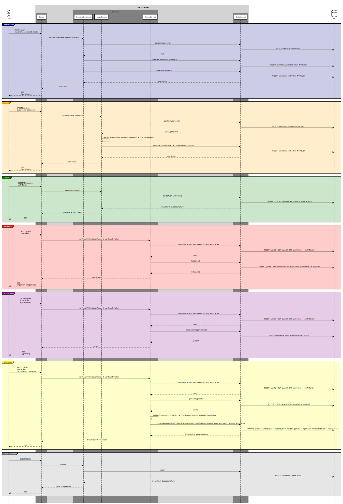

# ♕ BYU CS 240 Chess

This project demonstrates mastery of proper software design, client/server architecture, networking using HTTP and WebSocket, database persistence, unit testing, serialization, and security.

## 10k Architecture Overview

The application implements a multiplayer chess server and a command line chess client.

[](https://sequencediagram.org/index.html#initialData=C4S2BsFMAIGEAtIGckCh0AcCGAnUBjEbAO2DnBElIEZVs8RCSzYKrgAmO3AorU6AGVIOAG4jUAEyzAsAIyxIYAERnzFkdKgrFIuaKlaUa0ALQA+ISPE4AXNABWAexDFoAcywBbTcLEizS1VZBSVbbVc9HGgnADNYiN19QzZSDkCrfztHFzdPH1Q-Gwzg9TDEqJj4iuSjdmoMopF7LywAaxgvJ3FC6wCLaFLQyHCdSriEseSm6NMBurT7AFcMaWAYOSdcSRTjTka+7NaO6C6emZK1YdHI-Qma6N6ss3nU4Gpl1ZkNrZwdhfeByy9hwyBA7mIT2KAyGGhuSWi9wuc0sAI49nyMG6ElQQA)

## IntelliJ Support

Open the project directory in IntelliJ in order to develop, run, and debug your code using an IDE.

## Maven Support

You can use the following commands to build, test, package, and run your code.

| Command                    | Description                                     |
| -------------------------- | ----------------------------------------------- |
| `mvn compile`              | Builds the code                                 |
| `mvn package`              | Run the tests and build an Uber jar file        |
| `mvn package -DskipTests`  | Build an Uber jar file                          |
| `mvn install`              | Installs the packages into the local repository |
| `mvn test`                 | Run all the tests                               |
| `mvn -pl shared test`     | Run all the shared tests                        |
| `mvn -pl client exec:java` | Build and run the client `Main`                 |
| `mvn -pl server exec:java` | Build and run the server `Main`                 |

These commands are configured by the `pom.xml` (Project Object Model) files. There is a POM file in the root of the project, and one in each of the modules. The root POM defines any global dependencies and references the module POM files.

### Running the program using Java

Once you have compiled your project into an uber jar, you can execute it with the following command.

```sh
java -jar client/target/client-jar-with-dependencies.jar

♕ 240 Chess Client: chess.ChessPiece@7852e922
```
### Server Diagram
[](https://sequencediagram.org/index.html?presentationMode=readOnly&shrinkToFit=true#initialData=IYYwLg9gTgBAwgGwJYFMB2YBQAHYUxIhK4YDmUEArtjAMTKkAWY5wAnjAFwAMMAVHziMUAZxEwAyiigA3aQJx4CREiwrU6rDjxiL8hYsAyTpcqJnQATPcsNl1NWlq68pswqN259Ko2BgASiikSCJgUMAEEGhuMh42BqowADIQITGm8d62SQDiwAC2KLHxVgm+9lSOzjzldv4AIpHAAIIgIKIiFmjWZZbNAEbAIigwlgOYmORVdGjAMhxBIWERUWh0AO6MSGAomIioxgC0AHwmstKcMADaAAoA8hIAKgC6MAD0lCNQADpoAN5faRzIoAGhguDEG2glnBKAKwCQCAAvphYtIYKdAsFQuFIkhoiUOlcoDiwtIABRAqAglDgyEiaFQWEweGIhAASkwS1xqwJGXcHUxZyaYFa7U6V1IKDAAFVvlTvrSuaLxR0xMKxgMrhIAKLJXVwJ4wam0mAAMQC9wAsibvphVW11eIjlieSt8YTMsSYGhKAgENyyXi1kTRljHRKxFcQKTIih5ZTTYU6RDhoyYSrmk7OprxlcAJIAOT1AWNybBaahMLhCKRMGLT3udukQeWIf5Yc1kedMbjuxalDAjEVwJTWbFOY1WPzDZLurLLZpKfBwCHjCeEAA1ug502YGvhw7s1GXW7g3yvYKUFdDxvt+g27zPQK4kLXWd0VBb+vNzu0GipgYh+8DIOgYBXAATNw3B-P8d5-ugqJlFMDh0NARjSikaRIOstBbDsewHOBmpflcdyPK8HwjGI-JwRWqYMkyliol+mqpOkYZXAgOFoKOy6VkxmaYBxuFdhGJ69jA0pygqDETmquYztqkj6oa5ZKiuVYZsyFpWra1LHpOp6Yliomvh4Vz8fS6bMVy5ldgAPI5RzYZx3o3jAZhIAAZmwty2TC-EAHRCcyNnVsyHJ0PAwggFu4hhdYDked2kmSjAsYoPGg7DvxyoxXA-aeGgKAbAev4PgBPZKWcs7FqWGljpWCFVXuzZ3kZinTmZvFcRVw6IQBKXXqZn5Ad+A33v+gEXLAIHERgUEwXBrX-shPSTNMGhOKSu4cVQ-j4dsuz7GBxzjXN5ENGpTy6m87w0SIdFzJVM1sb17nXtxaSHRSa3oPZfWpRJxlSZYKAIDKKC5SOANoApU4unVKk3Qad16TaU0wAA6gAEguupTUNMAALwwI58MnF1SNjW5YkeVc4SUCg7w+cACAjDFEiUKe7zmuylCkiJwOjSBZEwMzrPs5zoy0A2PkwCIvPOj5-qzWYdOLRBMDQdw3TWKhMy0KSlgpLiMD5EU4jHYRZ2HP4WIS9cuS6lR7ykCmfzwxrwFnFbxSM150i+WwsNDf9b2AzFABqId+djkAzQH4kiul0bB1Aofh1VkeDVV0Xy3HWcJ3ektVTTJnKTqalGkuBYNJjtpl-jhPE215OU1HaDUzVPX+ym-XUg3mApyDadgxlyBhAHIgUojVcozXBp157RQN+CBG7ImAmpgMCCgFuO+0uCa8oEWKZN9JKaV86dNj99MDT2AFJnyIXIP2+4ZOxN3G4q-KZ36+3mlibWy1YIAgAERv0gX-MIADrYcg2obbajhsBC2wFDeAxVLaX1tqdbWpFf43AeM8B6Z9vbdzgmfC+RRWITU1J-Symds7dzztNaORd44cDLknR8TD3wT26iIK43k-I53-OwoahcYDF1DonCufdkZamXupeujdLRYxbgTAIRN4ZkwplTW+SksQCM8sPBoo9B7jxgEovs2VdgBwQefccxjpxLznI1a+RRaGpiypEaAx9L6NmbGfNxZ4B5FH6mfEeZi6YSxiZYj6oDzo6z1tQlMDdkFbTQrQNgkMeLlQAFIQFwrgoodB96H3tiRH+V0SGyndhQ16+d-xwW1nACAPEoCn0yQ0ehc1GHWMfmIsObD4YyLkaXdc5dk7DK-mlSeGdRkSPQFIgusduEKJmkovMKk9QryalABuV9tFt30Z3IxuyQJmKuBYqxUSbF2OkjKJxiSF532rqpQ5-Ar5n1xjoomiSDGOUSb3dOETymB0fmEuJzlXK3K8hzJA-RdglNws48EIBUmdO6TIoQKB4riH+TIZFlgdg8J6JlLp0ADykqRMAAYSIKUPOhQs0Gwi7nYFRSgAOOMdiMB3ri6AmLMo4ppT09u-4ZGym5fGbxowNgCqXAAcnECACVB4qW8MURCvZVxZS3AaC0DG-y9TGg6Zqzu2KHbCqgGcVuuiFUnM7mCmALQiyNwuYY7u4KlmQsRVLNmHMubyx5nzAWSIhZ7DieLYhQaZahoVkrFWnQ1aBmSWcMBusYIGxycbZwiBsqwGANgTBhAXybBOkRVJRD6nXDRm7e6HxxjAM1O6DsV4v4xihngeeT4PShieRCntxb+3XI8Y2jGmiDLfF6S1dc4S6YdsvBZH0CaQ1y0kKmsQ-NBbCxXS+cSdSzDgJigWRWytTzprbQtVJ4C81AA)